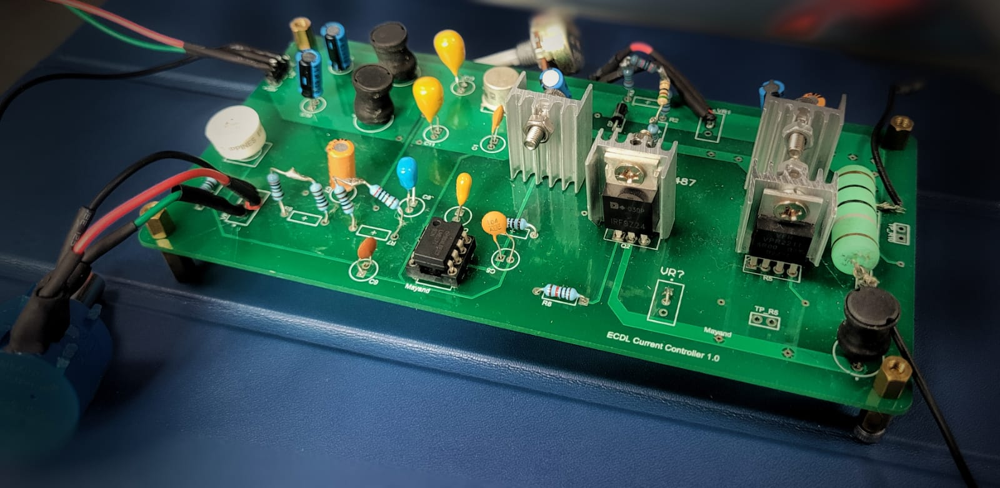

# Libbrecht-Hall style ultra-stable current driver for the custom designed External Cavity Diode Laser
#### Current Controller

## Introduction
The field of ultra-cold atom physics has witnessed significant advancements in recent years, offering valuable insights into quantum phenomena and enabling breakthroughs in quantum information processing and precision measurements. These laboratories utilize laser-cooled atoms to reach temperatures close to micro kelvin, enabling researchers to explore exotic quantum states and phenomena with unprecedented precision and control. 

Diode lasers play a crucial role in these setups, providing the necessary cooling and manipulation of the ultra-cold atoms. Diode lasers used in ultra-cold atom laboratories require precise and stable current control to maintain a narrow linewidth, stable frequency, and low noise levels. The diode laser current controller is responsible for delivering a stable and regulated current to the laser diode, ensuring its optimal performance. However, conventional current controllers often suffer from noise and instability issues, which can degrade the laser's performance and limit the accuracy of experiments.

The motivation of this project is to develop an improved version of the Libbrecht-Hall style current driver for driving external cavity diode lasers in the ultra-cold atom laboratory at IIT Delhi. The existing current controller has limitations in terms of current limits of 200mA. By addressing these limitations, we aim to provide a low-noise high current rating laser current controller that enhances the maximum current rating, precision and stability of the diode laser for ultra-cold atom experiments. To accomplish this, a new current controller is designed with a slight modification to its component that can handle current limits of 750 mA.

Through the development of this laser current controller, we anticipate significant improvements in the current limit of current controller. However, significant improvement in temperature stability is still a challenging part.

## Literature Review
### Diode Laser Current Control Techniques
Diode lasers are widely used in various fields, including ultra-cold atom laboratories, due to their compact size, high efficiency, and precise wavelength control. Achieving stable and low-noise current control is crucial for maintaining the diode laser's performance, linewidth, and frequency stability. Several techniques have been developed for diode laser current control.

One commonly used method is the proportional-integral-derivative (PID) control, which adjusts the laser current based on the difference between the desired current and the actual measured current. PID control provides stable and accurate current regulation but may suffer from limitations in terms of noise performance and response speed.

Another technique is the use of feedback control systems, where the diode laser current is continuously monitored and adjusted based on the feedback signal. This approach allows for real-time adjustments and improved stability. Various feedback control strategies, such as analog feedback loops and digital signal processing techniques, have been employed to enhance the performance of diode laser current control systems.

### Libbrecht-Hall Style Current Drivers
The Libbrecht-Hall style current driver is a popular choice for driving diode lasers in applications that require high stability and low noise levels. This current driver design, proposed by Libbrecht and Hall in 1993, incorporates a low-noise operational amplifier (op-amp) circuit that provides precise current regulation.

The advantages of the Libbrecht-Hall style current driver include simplicity, low cost, and effective noise reduction. It has been successfully used in various applications, including laser cooling and trapping of atoms, precision spectroscopy, and quantum information processing.

### Existing Challenges and Limitations
The circuit presented in paper "A low‐noise high‐speed diode laser current controller" has its current limitations of 200mA, while CAQT Lab application required current in range upto 500mA. By addressing these challenges and incorporating the latest advancements, we aim to develop an improved version of the Libbrecht-Hall style current driver for driving external cavity diode lasers in the ultra-cold atom laboratory at IIT Delhi. This will contribute to the advancement of ultra-cold atom research and provide researchers with a reliable and high-performance current control solution for their experiments.

## Circuit design and Simulations
### Circuit design specification
In this subsection, we present the design specifications and constraints for the new current controller aimed at driving external cavity diode lasers in the ultra-cold atom laboratory. The key objectives are to improve the current range and noise performance of the existing Libbrecht-Hall style current driver. The following design considerations were taken into account:
 - Current Range: The current controller should be capable of handling currents up to 750 mA, surpassing the limits of the original Libbrecht-Hall circuit.
 - Noise Performance: The current controller should exhibit minimal noise to maintain the stability and precision of the diode laser. The goal is to reduce current fluctuations below 50 μA for the high current range and below 10 μA for the low current range.
 - Component Compatibility: The selected components should be readily available, cost-effective, and suitable for high-speed operation.

### Optimization of the Libbrecht-Hall Circuit
Based on the design specifications, an optimization process was carried out to improve the current range and noise performance of the Libbrecht-Hall circuit. Various modifications were explored, including the selection of different operational amplifiers and adjustment of resistor values.

Resistor values were adjusted to optimize the gain and stability of the circuit while ensuring compatibility with the desired current range. Careful consideration was given to the selection of resistors with low temperature coefficients to minimize thermal drift and maintain stability.

### LTSpice Simulation and Performance Analysis
To assess the performance of the modified Libbrecht-Hall circuit and validate its design, LTSpice simulation tools were employed. The circuit was modeled using the selected components and the optimized parameter values.

The LTSpice simulations allowed for a detailed analysis of the circuit's behavior, including voltage and current waveforms. The simulations were performed under various operating conditions and current ranges to evaluate the circuit's stability and accuracy.

### Microcontroller Integration and Display Module
In addition to the circuit design optimization, a microcontroller (ATMega328P) was integrated into the current controller for enhanced functionality and control. The microcontroller was programmed to provide real-time monitoring and adjustment of the laser current.

A display module was also interfaced with the microcontroller to provide visual feedback of the current value. This allowed researchers to monitor the current levels and make adjustments as necessary during experiments.

The integration of the microcontroller and display module enhanced the usability and convenience of the current controller, enabling precise and real-time control of the diode laser current.

#### Image of Schematic's design

#### Image of PCB's Design

Through the circuit design and LTSpice simulations, we were able to optimize the Libbrecht-Hall style current driver, extending its current range and improving its noise performance. The integration of a microcontroller and display module added advanced control capabilities to the current controller. The next step involves the implementation of the designed circuit and conducting experimental tests to evaluate its performance in a practical setting.

In the future, it is planned to integrate microcontroller circuitry on the same PCB as the current controller to reduce space and costs. This design is highly miniaturized and cost effective, with an estimated cost of around $145 (12k INR). Currently, we are conducting tests to evaluate the new controller's noise performance and contrast it with the current Libbrecht-Hall circuit. The current fluctuations are about 50"mu"A below 200 mA, and they are about 1 mA around 350mA. We are targeting to increase its performance by bringing current fluctuations below 50"mu"A for the high current range and below 10"mu"A for the low current range. The system, which was created for preliminary testing, has a dimension of about 70mm x 150mm. This size can be reduced to about 60mm x 90mm without integrating a display system by switching out some SMT components for SMD ones and reorienting the components position.

We hope to benefit the scientific community by sharing this project on Github and offering a high constant current driver in low cost for noise-free driving of narrow-linewidth diode lasers or for any other applications.

### Refrences
<ul>
  <li> Libbrecht, K. G., and John L. Hall. "<a href="https://aip.scitation.org/doi/citedby/10.1063/1.1143949">A low‐noise high‐speed diode laser current controller.</a>" Review of scientific instruments 64, no. 8 (1993): 2133-2135.</li>
</ul>

This project was started by Aditya Choudhary and taken forward by both of us.
