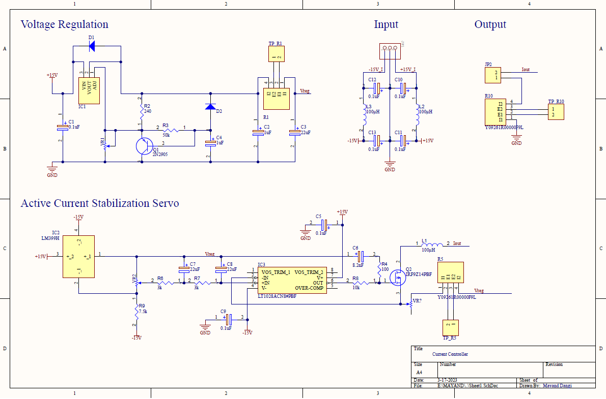
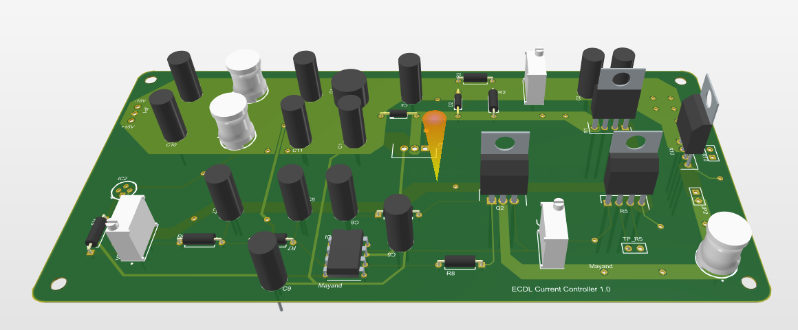

This project aims to develop an improved version of the Libbrecht-Hall circuit, a popular low-noise current driver for narrow-linewidth diode lasers, by developing a new current controller for the Cold Atom Quantum Technologies Lab at IIT Delhi. To accomplish this, a new current controller is designed with a slight modification to its component that can handle current limits of 600 mA.

Before implementing the new current controller in hardware, the circuit design will be optimized using simulation tools like LTSpice. Additionally, we will conduct tests to evaluate the new controller's noise performance and contrast it with the current Libbrecht-Hall circuit.

We hope to benefit the scientific community by sharing this project on Github and offering a more effective method for noise-free driving of narrow-linewidth diode lasers. Since our project will be open-source, other researchers will be able to use it and possibly build upon it to enhance the functionality of the Libbrecht-Hall circuit.

### Image of Schematic's design

### Image of PCB's Design

### Refrences
<ul>
  <li> Libbrecht, K. G., and John L. Hall. <a href="https://aip.scitation.org/doi/citedby/10.1063/1.1143949">"A low‐noise high‐speed diode laser current controller."</a> Review of scientific instruments 64, no. 8 (1993): 2133-2135.</li>
</ul>
